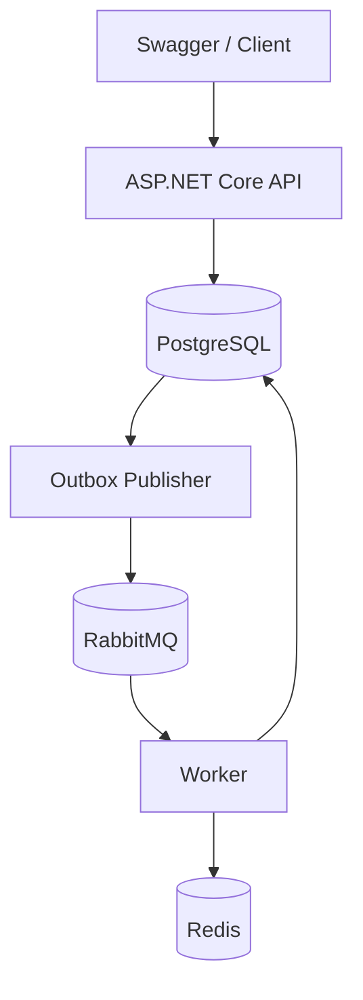

# RewardEngine

RewardEngine is a .NET backend service for processing transactions and calculating cashback rewards based on configurable loyalty rules.

## Features

- User and transaction management
- Configurable cashback rules
- Asynchronous reward processing
- PostgreSQL persistence
- RabbitMQ messaging
- Redis caching
- Unit and integration tests
- Docker Compose setup

## Architecture



The solution is split into several projects:

| Project | Responsibility |
|---|---|
| Domain | Entities and domain models |
| Application | Application services, DTOs and cashback calculation |
| Infrastructure | EF Core, PostgreSQL, Redis and RabbitMQ |
| Api | HTTP API and Swagger |
| Worker | Background processing |

## Technologies

- C# / .NET 8
- ASP.NET Core
- Entity Framework Core
- PostgreSQL 16
- RabbitMQ
- Redis 7
- Serilog
- Swagger
- xUnit
- Testcontainers
- Docker Compose

## How it works

1. The API receives and validates a transaction.
2. The transaction and an Outbox event are saved in PostgreSQL.
3. A background publisher sends the event to RabbitMQ.
4. The Worker consumes the event and loads the cashback rule.
5. Cashback is calculated and saved to PostgreSQL.
6. Redis is used to cache cashback rules.

Duplicate message delivery is handled by storing processed events and enforcing one reward per transaction.

## Running locally

Requirements:

- .NET 8 SDK
- Docker Desktop

From the repository root:

```bash
docker compose up --build -d
```

Swagger:

```text
http://localhost:5000/swagger
```

RabbitMQ management:

```text
http://localhost:15672
```

Stop the containers:

```bash
docker compose down
```

### Run from an IDE

Start infrastructure services:

```bash
docker compose up -d postgres rabbitmq redis
```

Run the API:

```bash
dotnet run --project src/RewardEngine.Api
```

Run the Worker in a second terminal:

```bash
dotnet run --project src/RewardEngine.Worker
```

## API

| Method | Route | Purpose |
|---|---|---|
| POST / GET | /api/users | Create and list users |
| GET | /api/users/{id} | Get a user |
| POST | /api/transactions | Create a transaction |
| GET | /api/transactions/{id} | Get transaction status |
| GET | /api/users/{userId}/transactions | Get user transactions |
| GET | /api/users/{userId}/cashback | Get total cashback |
| GET | /api/users/{userId}/cashback/history | Get cashback history |
| POST / GET | /api/cashback-rules | Create and list cashback rules |
| GET / PUT / DELETE | /api/cashback-rules/{id} | Read, update or deactivate a rule |
| GET | /health | Health check |

## Testing

Run all tests:

```bash
dotnet test
```

Run only unit tests:

```bash
dotnet test tests/RewardEngine.UnitTests
```

Integration tests use Testcontainers and require Docker to be running.
