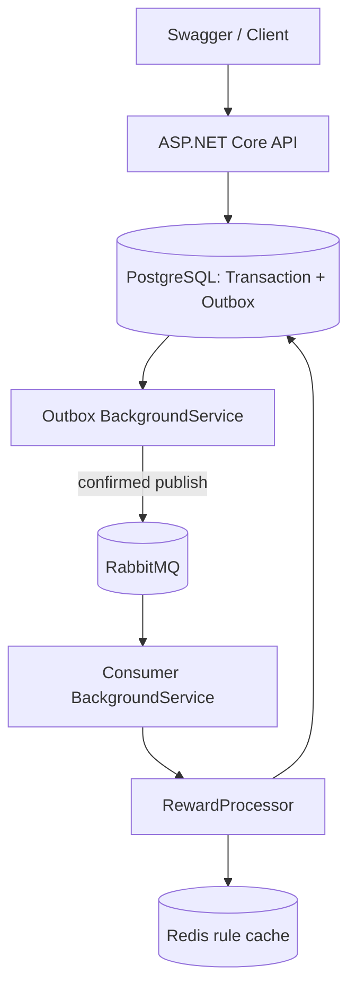

# RewardEngine

RewardEngine is a .NET backend service for processing transactions and asynchronously calculating cashback rewards based on configurable loyalty rules.

## About

An internship portfolio project focused on backend fundamentals: database transactions, reliable messaging, concurrency, validation, and integration testing. It simulates purchases; it does not connect to a bank or transfer real money. Swagger is the demonstration interface; there is no separate frontend.

## Features

- Users, transactions, editable category rules, reward totals and history.
- Decimal arithmetic, explicit rounding, per-user/per-category monthly limits.
- Atomic transaction + Outbox persistence.
- Persistent RabbitMQ messages with publisher confirms and manual acknowledgements.
- Duplicate-safe reward processing and PostgreSQL coordination across concurrent workers.
- Redis cache-aside with invalidation, short TTL and database fallback.
- Structured errors, Serilog, PostgreSQL readiness check, EF migrations.
- Real PostgreSQL/RabbitMQ/Redis integration tests; GitHub Actions build and test workflow.

## Architecture



| Project | Responsibility |
|---|---|
| Domain | Entities, enums, event contract |
| Application | DTOs, calculation, use-case services, interfaces |
| Infrastructure | EF mapping/migrations, Redis, RabbitMQ publishing, database-specific reward coordination |
| Api | Thin controllers, HTTP validation, Swagger, exception middleware |
| Worker | Long-running publication and consumption loops |

Application uses EF query extensions through a narrow DbContext interface. This is a pragmatic dependency, not a claim of framework-free Clean Architecture. No generic repository, MediatR, AutoMapper or extra unit of work is used.

## Technologies

C# / .NET 8, ASP.NET Core, EF Core, PostgreSQL 16, RabbitMQ, Redis 7, Serilog, Swagger, xUnit, Testcontainers, Docker Compose.

## How it works

1. API validates a purchase and verifies the user.
2. Purchase and Outbox event commit in one PostgreSQL transaction.
3. Publisher sends pending events; only broker confirmation allows setting `ProcessedAt`.
4. Consumer validates the event against the saved purchase and acquires a transaction-scoped PostgreSQL advisory lock for its user.
5. It checks `ProcessedEvents` and existing rewards, loads the active rule, calculates remaining category/month allowance, and commits reward + processed event together.
6. The consumer acknowledges the broker delivery after the commit.

A crash between broker confirmation and the Outbox update can cause another publication. A crash between reward commit and acknowledgement can cause redelivery. Both are expected: delivery is **at least once**, while a unique `TransactionId` on rewards prevents duplicate rewards.

### Business semantics

- Currency is implicitly RUB; multi-currency purchases are outside scope.
- Amounts and rule values accept at most two decimal places. Cashback uses `MidpointRounding.AwayFromZero`.
- A limit belongs to **one user + one category + calendar month in UTC**, determined by the saved purchase timestamp, not processing time.
- Reward `CreatedAt` is the actual processing time. Delayed December purchases still consume December allowance.
- Rules apply at processing time, not purchase submission time. Changing a rule does not recalculate existing rewards.
- Missing/inactive rules and exhausted limits produce an explicit zero reward.
- One rule per category, including inactive rules. All six categories are seeded, so POST for an existing category returns 409; use PUT to edit/reactivate it.
- Cache invalidation usually exposes a rule change immediately. A failed invalidation or concurrent cache fill can leave stale data for up to the 30-second TTL. This is an explicit consistency tradeoff.
- A user-level database lock serializes reward writes for that user across workers, preventing limit races. Different users can proceed independently.

## Running locally

Install Docker Desktop and start its Linux engine. On Windows, the WSL 2 backend can be used.

From the repository root:

```bash
docker compose up --build -d
docker compose ps
```

Open [Swagger](http://localhost:5000/swagger) and [RabbitMQ management](http://localhost:15672). Development broker credentials are `rewardengine / rewardengine_dev`. All exposed ports bind to loopback.

API applies migrations before accepting requests; Compose starts Worker after API becomes healthy. Existing data is preserved in PostgreSQL and RabbitMQ named volumes.

```bash
docker compose logs -f api worker
docker compose down
```

Do not add `-v` unless you intend to erase the development volumes.

### Run from an IDE

Requires a .NET 8 SDK (or compatible newer stable SDK):

```bash
docker compose up -d postgres rabbitmq redis
dotnet restore
dotnet run --project src/RewardEngine.Api
# In a second terminal:
dotnet run --project src/RewardEngine.Worker
```

Stop the Compose API/Worker first if they are running to avoid port conflicts and extra consumers. API uses port 5000 in both modes. Environment variables such as `ConnectionStrings__Postgres` override development settings.

### Migrations

```bash
dotnet tool restore
dotnet ef migrations list --project src/RewardEngine.Infrastructure
dotnet ef migrations add YourChange --project src/RewardEngine.Infrastructure
```

Migrations and the model snapshot are committed. Startup migrations are convenient for this single-host demo; production deployments should use a separate migration step.

## API

| Method | Route | Purpose |
|---|---|---|
| POST / GET | /api/users | Create/list users |
| GET | /api/users/{id} | Read user |
| POST | /api/transactions | Save purchase and Outbox event |
| GET | /api/transactions/{id} | Read purchase and processing status |
| GET | /api/users/{userId}/transactions | User purchases |
| GET | /api/users/{userId}/cashback | Total cashback |
| GET | /api/users/{userId}/cashback/history | Rewards with purchase details |
| POST / GET | /api/cashback-rules | Create/list rules |
| GET / PUT / DELETE | /api/cashback-rules/{id} | Read/edit/deactivate |
| GET | /health | API and PostgreSQL readiness |

### Five-minute demo

1. POST /api/users with `{"name":"Tigran"}`; copy the returned ID.
2. POST /api/transactions with that ID:

```json
{
  "userId": 1,
  "amount": 5000,
  "category": "Restaurants",
  "merchant": "Demo Restaurant"
}
```

3. After a few seconds, query cashback/history. With the seed rule, the reward is 250 RUB.
4. Send more restaurant purchases to observe the 3000 RUB category limit.
5. Query transaction status: it changes from Created to Rewarded.

Creation returns 201, reads/updates 200, deactivation 204, invalid input 400, missing resources 404, duplicate rule 409. Application errors have `error/message`; automatic model validation uses ASP.NET ValidationProblemDetails.

## Testing

Docker must be running for integration tests. Tests create isolated containers and do not modify the development database.

```bash
dotnet restore
dotnet build
dotnet test
# Fast calculator/model tests without Docker:
dotnet test tests/RewardEngine.UnitTests
```

Tests cover calculation boundaries and rounding, migrations, duplicate and concurrent events, cross-category and cross-month limits, invalid event payloads, API validation, atomic Outbox creation, real reward history, database uniqueness, confirmed broker publication, Redis invalidation and unavailable-cache fallback. No tests are disabled by default.

The GitHub workflow runs the same suite on an Ubuntu runner with Docker.

## Engineering decisions

**Why RabbitMQ?** Accepting a purchase and computing its reward have independent lifetimes. Queueing allows work to wait while the worker is unavailable.

**Why Outbox?** PostgreSQL commit and broker publication are not one atomic operation. Saving the future event with the purchase makes interrupted publication retryable.

**Why idempotency?** Brokers can redeliver. Processed event IDs, a unique reward-per-purchase constraint and an atomic database commit prevent repeat rewards.

**Why Redis?** Rules are read frequently; cache-aside reduces reads. PostgreSQL remains the source of truth and a failed cache read is a miss.

**Why decimal?** Money needs predictable decimal arithmetic and explicit rounding; binary float/double are unsuitable here.

**Why thin controllers?** HTTP routing/status codes are separate from business calculations and database coordination.

**Why BackgroundService?** The host manages long-running work, dependency scopes and graceful cancellation outside request lifetimes.

Publisher confirmation behavior follows the [RabbitMQ .NET guide](https://www.rabbitmq.com/tutorials/tutorial-seven-dotnet).

## Failure handling and scope

- Broker unavailable: Outbox stays pending, retry count grows, exponential delay is capped at 32 seconds.
- Database unavailable: API readiness fails; consumer retries with a five-second delay without acknowledging unfinished work.
- Malformed/inconsistent broker events: copied with confirmed publication to `transaction-created.failed` for manual investigation.
- Valid messages with transient failures retry indefinitely with delay. There is no automated failure-queue replay or operational alerting.
- Redis unavailable: log and database fallback. Cache is an optimization, not durable storage.
- Multiple publishers may publish the same Outbox row; consumer idempotency handles this. There is no claim of exactly-once transport.
- No authentication/authorization, pagination, refunds/reversals or public deployment configuration. Designed for local demonstration and a small dataset, not real banking traffic.
- No HTTP idempotency key: submitting two POST requests creates two distinct purchases.

## Learning

[INTERVIEW_GUIDE.md](INTERVIEW_GUIDE.md) explains the code in Russian, contains 30 interview questions and a study sequence. [VERIFICATION.md](VERIFICATION.md) records the checks actually executed for the delivered version.

